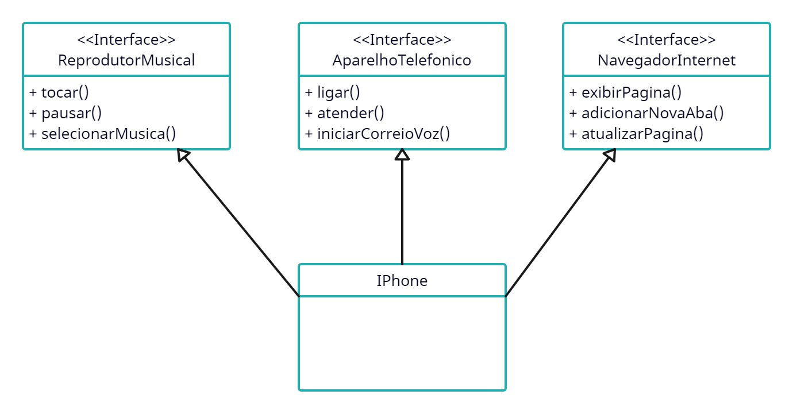

## Desafio de Projeto:
# Orientação a Objetos e UML: Diagramação de Classes do iPhone

### Instrutor: [Gleyson Sampaio](https://github.com/glysns)

---
 
Desafio desenvolvido durante o Santander Bootcamp 2023 - Fullstack Java+Angular.

## Instruções: ([GitHub](https://github.com/digitalinnovationone/trilha-java-basico/tree/main/desafios/poo))

>## POO - Desafio
>
> Modelagem e diagramação da representação em UML e Código no que se refere ao componente iPhone.
>
> Com base no vídeo de lançamento do iPhone conforme link abaixo, elabore em uma ferramenta de UML de sua preferência a diagramação das classes e interfaces com a proposta de representar os papéis do iPhone de: Reprodutor Musicial, Aparelho Telefônico e Navegador na Internet. Em seguida crie as classes e interfaces no formato de arquivos .java
>
> [Lançamento iPhone 2007](https://www.youtube.com/watch?v=9ou608QQRq8)
>
> * Minutos relevantes do 00:15 até 00:55
>
> ### Comportamentos esperados:
> * Repodutor Musicial: tocar, pausar, selecionarMusica
> * Aparelho Telefônico: ligar, atender, iniciarCorrerioVoz
> * Navegador na Internet: exibirPagina, adicionarNovaAba, atualizarPagina

## Resolução:
* Criação de Diagrama de Classe seguindo as instruções:

* Criação das Interfaces [ReprodutorMusical](./src/ReprodutorMusical.java), [AparelhoTelefonico](./src/AparelhoTelefonico.java) e [NavegadorInternet](./src/NavegadorInternet.java).
* Criação da Classe [IPhone](./src/IPhone.java) implementando as interfaces citadas ascima.
* Criação da Classe [Program](./src/Program.java) com método main com alguns exemplos de uso da classe IPhone.

